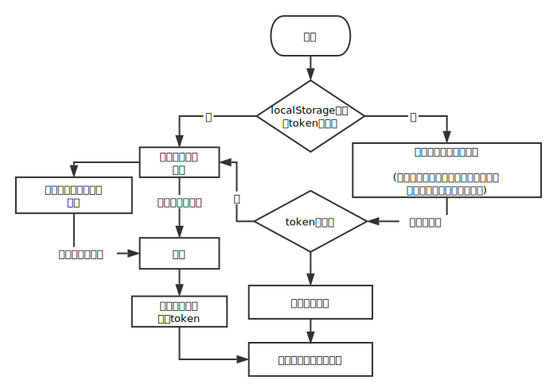
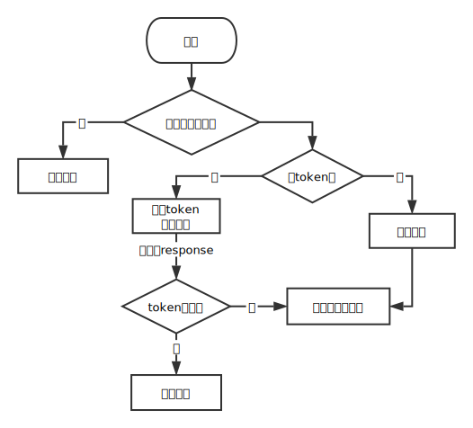

随着用来构建界面的JavaScript库越来越流行，现在也有越来越多的web应用使用前后端分离的方案。但是不管原始的web开发模式也好，前后端分离的模式也罢，绕来绕去始终都绕不开权限管理这个坎。<!-- more -->

## 前后端交换用户信息的模式
由于HTTP协议的限制，传统的开发方式中，服务器通过放在Cookie中的Session来区分不同的用户。而前后端分离的开发方式中，前端页面和资源可能直接由nginx这类HTTP服务器程序直接代理，或是直接放在对象存储的容器中，而不通过web的后端应用程序。这么做的好处可以方便前后端快速迭代，也可以节约一部分服务器资源。

因此，在这种部署的模式下，前后端交换数据只使用ajax请求，服务器辨认用户的方式就有可能需要使用到token。这个token其实可以理解为session的一种实现方式，由服务器生成，里面包含了用户标识、过期时间等信息。

对于前端而言，可以把这个token保存在localStorage里（如果网站涉及到跨域名的话，也可以存在Cookie里面）。前端在登录时（依情况而定，也可能是除此打开网页时）向后台请求一个用户令牌（token），之后只需要每次请求时在请求内带上token信息即可。

## 打开webapp时判断登录状态

假定localStorage中存在token字段，即视为用户已登录，如果不存在则视为未登录状态。那么，前端页面在打开时大致需要做的事情如下：



对应的代码大致如下

```jsx
class App extends React.Component {
  componentWillMount() {
    // 如果当前用户为登录状态
    if (authState) {
      // 请求用户数据
      requset.fetchUserData()
        .then(res => {
          // 假定res.status是ture为token有效，false为token过期
          if (res.status) {
            // 保存用户信息
            setUserData(res.data);
          } else {
            // 将用户登录状态标位未登录
            removeAuthState();
            // 可以可以依情况跳转到登录页面
            jumpToLogin();
          }
        })
    } else {
      // 当前用户为非登录状态，可以依情况跳转到登录页面
      jumpToLogin();
    }
  }

  render() {
    return null;
  }
}
```

## 发送请求时根据登录状态进行拦截

有一些请求需要在登录情况下进行，在发送请求之前应该先判断当前是否处于登录状态，如果是则将token放入请求中并发送请求，否则取消请求并跳转到登录页面。请求发出后，如果遇到token过期，则在收到请求后抛出异常，将本地的token清除，并跳转到登录页面。

这个过程的流程大致是这样的：



这一部分代码可以参考上一篇文章[axios权限拦截](2017/20171112axios-auth-interceptors/)，大致如下：

```js
// 先预定义好一个axios实例r
const r = axios.create({
  // your config
});

const CancelToken = axios.CancelToken;
const source = CancelToken.source();
r.defaults.cancelToken = source.token;

r.interceptors.request.use(
  config => {
    // 从store中获取数据
    const authState = store.getState().auth;
    if (!!authState.loginState) {
      config.headers['token'] = authState.token;
    } else {
      // 取消请求
      source.cancel('No Permission');
      // 跳转到登录页面
      jumpToLogin();
    }
    return config;
  },
  error => Promise.reject(error)
);

r.interceptors.response.use(
  res => {
    // 判断是否token无效，假定这里的标志是errCode = 1
    if(!res.status && res.errCode === 1){
      // 把token移除
      removeToken();
      // 跳到登录页面
      jumpToLogin();
      // 报错并将这个请求的后续操作打断
      return Promise.reject('Token expired');
    }
    return res;
  },
  error => Promise.reject(error)
);
```

## React Router页面权限拦截

在未登录的状态下，不仅需要对请求进行拦截，还需要对一些页面进行拦截，如果未登录用户请求访问一些需要登录的页面，就需要自动跳转到指定页面。这个工作当然可以再每个页面组件的`constructor()`或`ComponentWillMount()`状态下进行，但是为了简便可以直接将他们封装成一个组件。

具体代码如下：

```js
const AuthRequireRouter = ({component: Component, ...rest}) => (
  <Route {...rest} render={props => (authState ?
    <Component {...props}/> :
    <Redirect to={'/login'}/>
  )}/>
);
```

这个组件的使用方法和其他Route组件无异。

在实际使用中，大多数系统中不可能只有一种用户身份，这就需要根据实际业务需求进行更细粒度的权限控制。在传统的开发模式中，这一部分的内容完全由后台维护。而在现在的情况下，由于我们会把所有代码都打包再推送到前端，通过一些技术手段是可以看到那些无权限访问的内容模板的，因此前后端都需要同时维护一份用户权限的表，后台需要对一些接口进行权限拦截。

在前端向后台获取用户信息的时候，需要一并将用户的权限信息获取下来。在不同用户访问不同页面之前，需要先检查用户是否有该权限，如果有则将页面渲染出来，如果没有则跳转到其他页面。在React Ruter中对应的代码如下：

```js
const PrivateRouter = ({component: Component, authName, ...rest}) => (
  <Route {...rest} render={props => (permissionNamesHas(authName) ?
      <Component {...props}/> : <Redirect to={`/a/welcome`}/>
  )}/>
);
```

这个组件在使用时，只需要在props中指定所需要的权限名authName即可。

## 细粒度的组件权限控制

当然，不只有Router组件需要进行一些权限控制，还要对更小粒度的一些组件进行权限控制，例如：管理员的菜单中就会比普通用户的菜单多出更多东西。做这个最简单方法当然就是在`render()`中直接`if()...else...`，当然我们也可以封装成一个组件出来，对应的代码如下：

```jsx
class AuthRequire extends React.Component{
  render(){
    const {authName, children} = this.props;
    return permissionNamesHas(authName) ? children : null;
  }
}
```

使用时，在props中指定所需要的权限，在组件内写上渲染的内容即可，例如，一个管理员菜单：

```html
<ul>
  <li>个人资料</li>
  <li>退出</li>
  <AuthRequire authName="manager">
    <li>管理</li>
  </AuthRequire>
</ul>
```

## 最后

以上大致就是一个React项目进行权限管理的方法，可能有很多不足之处，希望对各位有帮助。