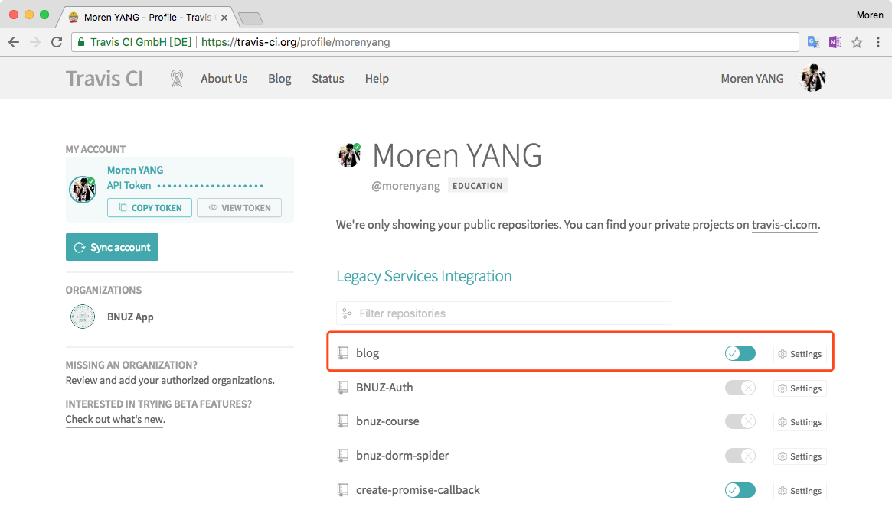
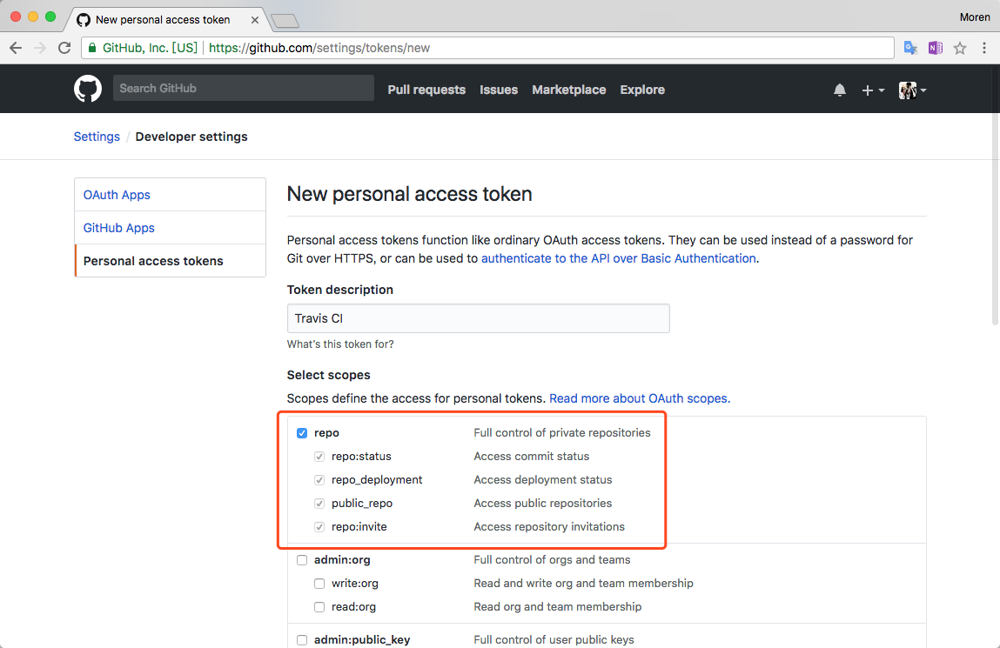
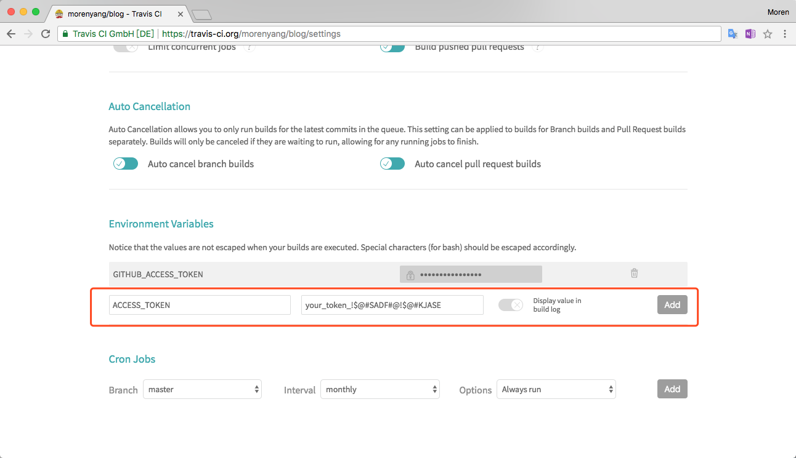

之前使用Hexo的时候，都是在本地进行编译和部署的，平时使用的时候觉得没什么，只需要

```bash
hexo g
hexo d
```

两步就可以把博客更新的内容推到GitHub Pages上。但是某些时候可能会遇到你的文件夹中存在一些其他编辑到一半的文章——这时候想要更新博客中的某些内容但同时不想把没写完文章发布出去的话，就必须要先把那几篇文章移到其他地方，更新完复制回去。

这种蠢办法虽然有效但是十分麻烦——所以这次我们要上一些更牛逼的工具，例如——Travis CI。

## 思路

做这件事的大体思路就是——以 _remote_ 端的仓库为标准，来生成我们我们的博客。我们只需要把需要发布或者更新的内容push到远程仓库，持续集成工具就会帮我们把仓库中的内容clone下来，然后再在它的容器里进行编译、部署的流程。

开始之前首先要说的是，我的博客使用GitHub Pages来托管。源文件存放在 `master` 分支里，页面文件存放在 `gh-pages` 分支里。

## 启用 Travis CI

首先用你的GitHub账户登录[Travis CI](https://travis-ci.org/)

登录之后，在你的个人信息页面可以看到你GitHub中的所有仓库（如果没有的话授权一下就有了），找到你的博客所在的仓库，把右边的开关键拨到打开的状态。



点击右边的按钮进入设置页面，在设置页面中我们可以设置什么时候需要CI工具执行`Build`、配置环境变量、配置定时任务等。

这里推荐把 _Build only if .travis.yml is present_ 这一项打开。

## 为 Travis CI 配置登录权限

动动脑想一想就能知道——如果我们在一个陌生的容器中执行了编译操作然后想要推送到自己的GitHub仓库中时，**是没有权限的**——我们既没有配置SSH Key也没有在任何位置输入过密码。这里我们要用一个安全、稳定、便捷的手段来解决权限这个问题。

Access Token是一个好的解决方案。你可以理解成我们为给这个应用程序单独生成了一个口令，这个口令里包含了我们的账户和密码，我们在将要把代码推送到Github仓库的时候，告诉他这个口令，他就会把放行我们的推送请求了。

首先去GitHub给账户添加一个Personal Access Token。打开GitHub，在 _Settings_ 页面中找到 _Developer settings_ ，打开 _Personal access tokens_ 标签页，点击新建一个token。

为这个Token取个名字，然后勾选 _repo_ 这一栏，点击保存。



如果不出意外，保存后屏幕上会显示一行乱码——这就是服务器为你生成的口令。 ~~你需要先把他复制下来，因为在此之后你是看不到这个口令的。你也不必把它记在小本本上，如果有需要再生成一个~~

我们在Travis CI中把口令设置为一个环境变量。打开刚才Travis CI中blog仓库的设置页面，在环境变量一栏把 _access_token_ 作为一个value填写进去，然后给它取个好听的名字，点击添加。 推荐不要勾选 _Display value in build log_ 不然别人可以在日志里看到你的口令。


_可以看到上面那一行是之前添加过的token。正常情况下别人是不会看到你的口令的_

在Travis CI服务端需要设置的就是这些，接下来要在仓库中添加Travis CI的配置文件。

## 添加配置文件

首先要看一下你hexo的配置文件 `_config.yml` 中部署那一块的配置，以我的为例——
```yml
# Deployment
## Docs: https://hexo.io/docs/deployment.html
deploy: 
  type: git
  repo: https://github.com/morenyang/blog.git
  branch: gh-pages
```

这里的指定了博客的仓库链接和部署的分支。这里的仓库链接过一会是要被替换成token形式的链接。

在仓库的根目录下，新建一个 `.travis.yml` 文件，然后将以下内容写进去，并将该改的地方改一下：

```yml
language: node_js
node_js: --lts
before_script:
  - git config user.name "YOUR_NAME"
  - git config user.email "YOUR_EMAIL"
  - sed -i'' "s~https://github.com/<yourname>/<reponame>.git~https://${GITHUB_ACCESS_TOKEN}@github.com/<yourname>/<reopname>.git~" _config.yml
script:
  - hexo g
  - hexo d
```

说明一下：
- language 一项指的是容器的运行环境
- node_js 一项指的是运行环境中node的版本，可以参照 _nvm_ 的版本写法
- before_script 指的是在执行操作前要运行的命令。
	- 这里我们指定了 git 的一些配置
	- 然后使用sed命令将hexo的配置文件中的部署仓库的链接替换成了access_token形式，其中前面的那一串是你在`_config.yml`中的链接，后面的那一串是token形式的链接。 **`${GITHUB_ACCESS_TOKEN}`** 就是我们刚才为access_token配置的环境变量中的变量名。 ~~这里记得把yourname和reponame换成你的~~
- script 指的就是build的时候需要执行的命令了，这里根据平时的习惯设置为 `hexo g` 和 `hexo d`
- 如果有其他需要，你还可以加入自己的配置，例如设置分支、设置其他环境变量，还有一些生命周期的hook之类的，具体可以去查一下

## 亲手试一把

到这里我们就大功告成了，在把配置文件推送到远程仓库后，你只需要把你更新的内容推送上去，你就可以在Travis CI的网站中看到实时的编译和部署情况了。

### 参考
- [How to publish to Github Pages from Travis CI?
](https://stackoverflow.com/questions/23277391/how-to-publish-to-github-pages-from-travis-ci)
- [Travis CI自动化部署Hexo](https://segmentfault.com/a/1190000004714256)
