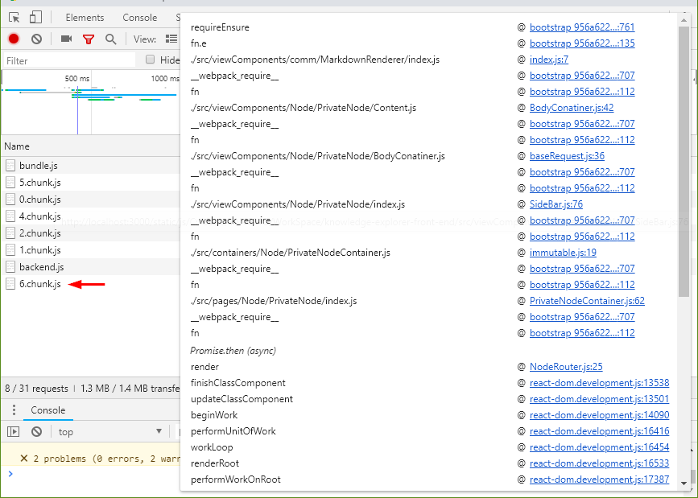
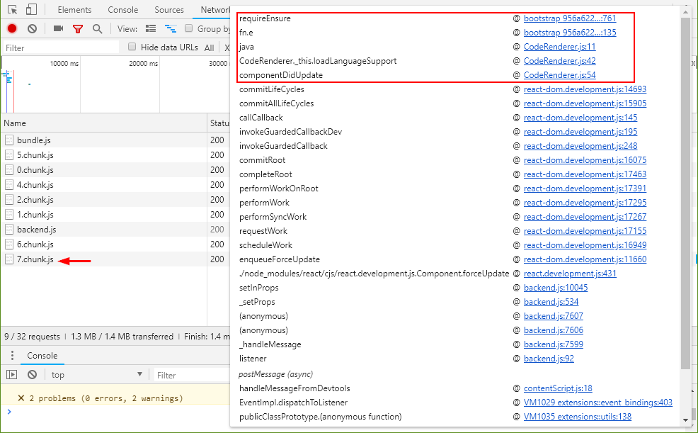

## *更新*

新版本的React已经自带了 `React.lazy` 方法来实现按需加载，这篇文章看看就好啦。

*https://reactjs.org/docs/code-splitting.html#reactlazy*

## 起因

在React 项目中常会遇到打包出来的bundle 过大而引发的页面加载速度过慢或是性能问题。因此，如果能够将使用的模块按需在使用时动态加载，就可以很大程度地减少资源浪费并优化首次加载速度。

例如，在使用highlight.js 时，官方为我们提供了176种语言的支持，每种语言支持包的大小从1K到几十K不等，一次性全部加载就需要load 1MB的资源。而如果采用按需加载的方式，每次就只需要load 几K的资源。想想就很酷。

在webpack v2 之后的版本中，可以使用 `import()` 来完成代码分割和动态载入。借助这个feature ，可以实现上文预想的功能。

## 关于 import()

JavaScript 中的模块是纯静态的。使用`import` 和`export` 的语句必须放在模块的顶层，它们会在 __编译__ 时执行（而不是运行时）。因此，如果你在JS代码编译之后修改了module 中的内容，即使还没有用到它，也无法对运行中的程序造成影响。另外，如果想把`import` 语句放在`if` 代码块中或函数也是不行的，这么做会报语法错误。

这个feature 带来的好处是可以提高编译器的执行效率，但是无法在运行时加载模块。

为了解决这个问题，有一个[提案](https://github.com/tc39/proposal-dynamic-import)建议引入`import() ` 方法来进行动态加载。例如：

```js
const specifier = './module.js';
import(specifier)
  .then(someModule => someModule.foo());
```

`import()` 方法和`import` 语句能使用的参数是一样的，它使用起来类似于一个函数。在ES6中， `import()` 方法会返回一个`Promise` 对象。当模块加载完成时，实现这个`Promise` 。

通过`import()` 方法，可以按需求加载模块，例如：

```js
button.addEventListener('click', () => {
    import('./dialogBox.js')
        .then(dialogBox => {
            dialogBox.open();
        })
        .catch(error => {
            /* Error handling */
        })
});
```

或者将需要加载的模块放在判断中：

```js
if(condition) {
    import("module")
}
```

还可以配合Promise的特性来加载模块：

```js
Promise.all([
    import('./module1.js'),
    import('./module2.js'),
    import('./module3.js'),
]);
```

在webpack 中，如果使用`import()` 函数来加载模块，webpack 在打包时会自动将模块拆分，并仅在需要使用时才载入这个模块。

## 在React 中动态加载模块

在React 中使用`import()` 对模块动态加载，需要合理地搭配生命周期函数。

以上文所说的应用场景为例，它的基础用法大致如下：

```js
import React from 'react';
import Lowlight from 'react-lowlight';
import PropTypes from 'prop-types';
import js from 'highlight.js/lib/languages/javascript';

// 使用之前要先对模块进行注册
Lowlight.registerLanguage('js', js);

class CodeRenderer extends React.Component {
  static propTypes = {
    value: PropTypes.string,
    language: PropTypes.string,
  };

  static defaultProps = {
    value: '',
    language: 'js',
  };

  render() {
    return <Lowlight value={this.props.value} language={this.props.language} />;
  }
}

export default CodeRenderer;
```


为了动态加载模块，需要修改成如下的样子：

```js
import React from 'react';
import Lowlight from 'react-lowlight';
import PropTypes from 'prop-types';

const supportLanguages = {
  js: () => import('highlight.js/lib/languages/javascript'),
};

class CodeRenderer extends React.Component {
  static propTypes = {
    value: PropTypes.string,
    language: PropTypes.string,
  };

  static defaultProps = {
    value: '',
    language: 'js',
  };

  state = {
    displayLanguage: '',
  };

  static getDerivedStateFromProps(nextProps, prevState) {
    const language = nextProps.language,
      displayLanguage = prevState.displayLanguage;
    if (language === displayLanguage) return null;

    // 如果新的language 已被注册， 直接在下一次render 中使用该language渲染
    if (Lowlight.hasLanguage(language)) {
      return { displayLanguage: language };
    }

    // 否则按没有指定language 进行渲染
    return { displayLanguage: '' };
  }

  loadLanguageSupport = () => {
     // 如果没有指定language 并且highlightjs的库中有对这个language提供支持
    if (!this.state.displayLanguage && supportLanguages.hasOwnProperty(this.props.language)) {
      const syntaxBundle = supportLanguages[this.props.language];
      syntaxBundle().then(bundle => {
        // 注册新的 language
        Lowlight.registerLanguage(this.props.language, bundle);
        // 更新state
        this.setState({ displayLanguage: this.props.language });
      });
    }
  };

  componentDidMount() {
    this.loadLanguageSupport();
  }

  componentDidUpdate() {
    this.loadLanguageSupport();
  }


  render() {
    if (!this.state.displayLanguage)
      return (
        <pre>
          <code>{this.props.value}</code>
        </pre>
      );
    return <Lowlight value={this.props.value} language={this.state.displayLanguage} />;
  }
}

export default CodeRenderer;
```


这里主要做了几件事：

- 将语言支持的模块变成了一个function (`import('highlight.js/xxx')`) ， webpack 会将它自动拆分；
- 当state 中的`displayLanguage` 为空时，视为没有载入这个语言的支持模块；
- 在`componentDidMount` 中和`componentDidUpdate` 中，载入所需要的语言支持模块并将其注册，然后再更新`state` 并重新render。
- 在`render`时，如果没有载入当前语言的支持模块，则按照普通的文本进行渲染。当然也可以在`shouldComponentUpdate` 中设置减少重新渲染的次数以提升性能。


由于将没有注册的language 作为props传入`Lowlight` 组件时会报错，因此更新state（包括`setState` 或在`getDerivedStateFromProps` 中返回新的值）这个动作必须发生在`Lowlight.registerLanguage` 之后。由于无法预测何时可以加载完成并注册语言的支持包，因此不能将`import()` 的异步动作放在`getDerivedStateFromProps`  中。

使用Chrome调试台查看一下效果。




这是首次打开时加载的内容。其中chunk6是当前页面的模块。


然后手动修改markdown中代码块的语言为`java` ，可以看到载入了一个新的chunk




查看调用栅可以看到是通过上述代码异步加载的模块。


## 最后

在React 中动态加载模块可以让你的Application 运行起来更有效率。其实动态加载模块还可以用在页面拆分、组件异步加载等功能上。可以参考[这篇文章](https://serverless-stack.com/chapters/code-splitting-in-create-react-app.html) 。同时，在npm上还有很多用于组件异步加载的package 可以直接使用。


另外，如果你使用的是webpack v1, 可能需要使用[babel-plugin-dynamic-import-webpack](https://github.com/airbnb/babel-plugin-dynamic-import-webpack) 这个package将`import() ` 转为`require.ensure。`


## 参考

- https://webpack.js.org/guides/code-splitting/
- http://2ality.com/2017/01/import-operator.html
- https://serverless-stack.com/chapters/code-splitting-in-create-react-app.html